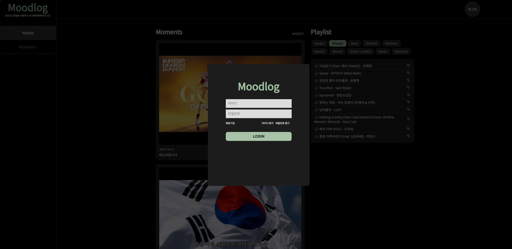
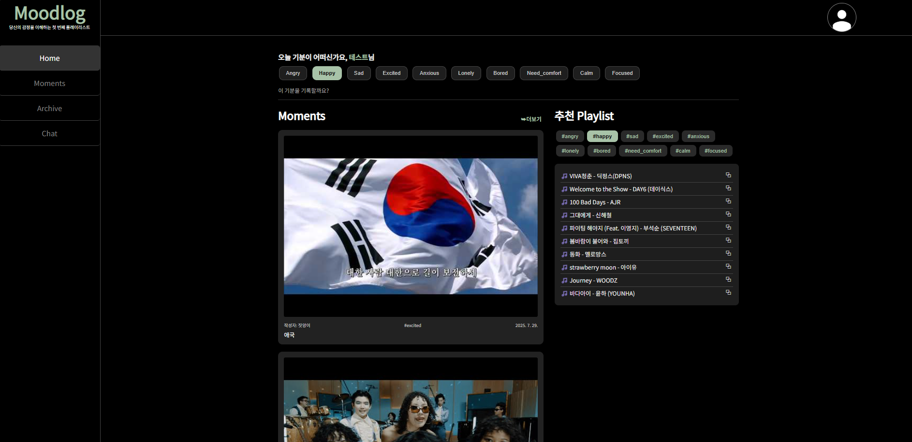
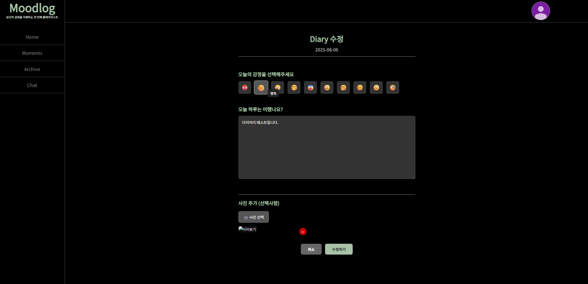
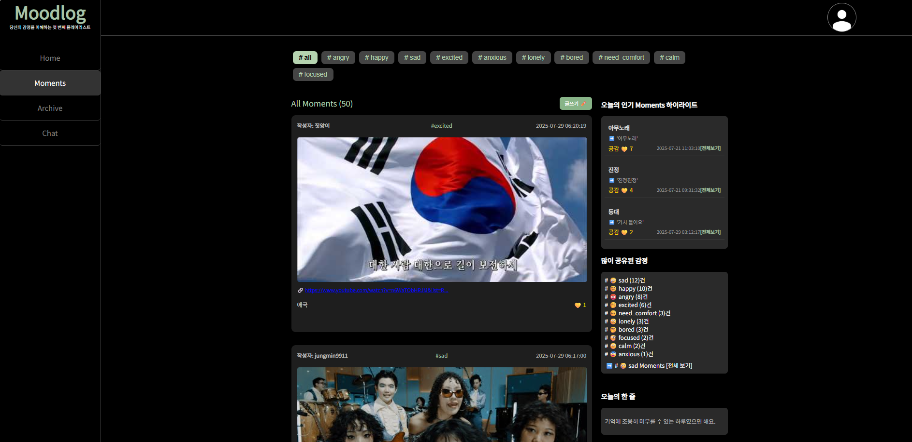
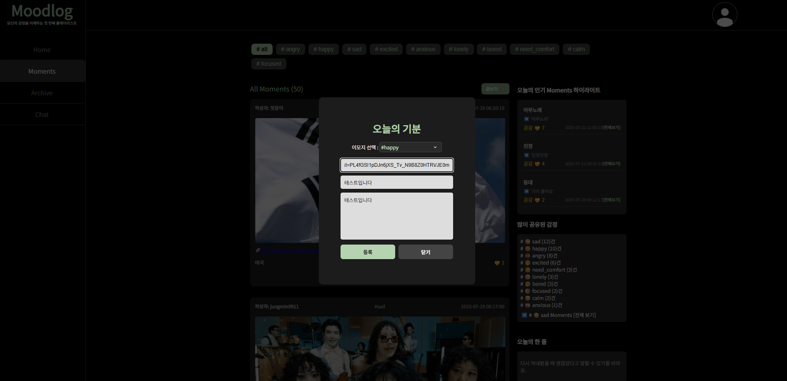
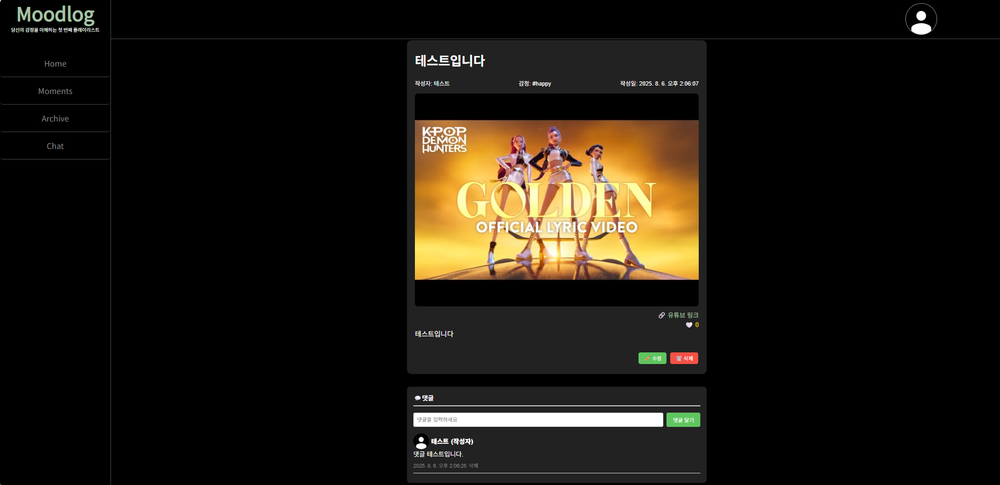
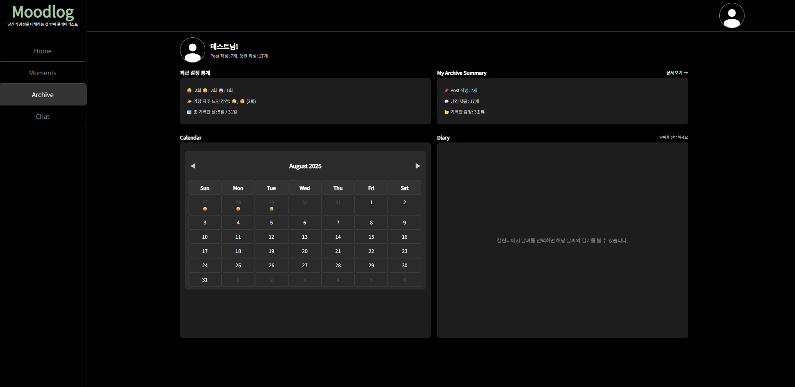
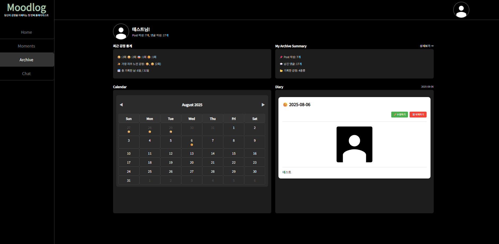
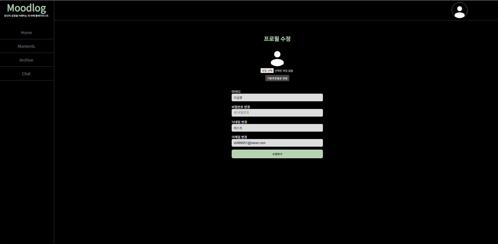
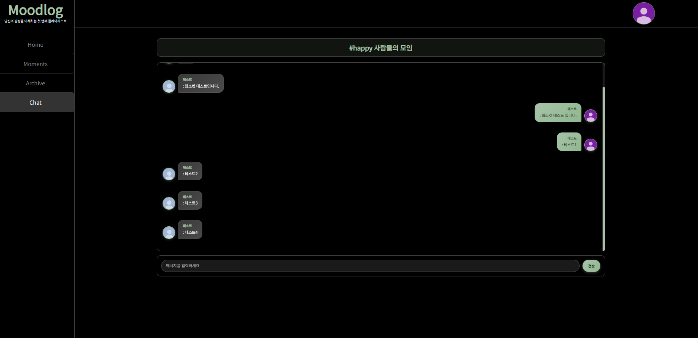

<h1 align="center">Moodlog</h1>

  

<h3 align="center">"당신의 감정을 이해하는 첫 번째 플레이리스트"</h3>

> **Moodlog**는  
> 감정을 선택하면 플레이리스트가 추천되고,  
> 그날의 감정을 감성 일기로 기록할 수 있는 **음악 기반 감정 기록 서비스**입니다.

## 📌 프로젝트 개요

| 항목           | 내용                                                                                          |
| -------------- | --------------------------------------------------------------------------------------------- |
| **프로젝트명** | Moodlog                                                                                       |
| **개발 기간**  | 2025.07.01 ~ 2025.07.29                                                                       |
| **참여 인원**  | 총 5명 · 프론트엔드: 김지상, 이경주 · 백엔드: 양은지, 이성훈, 정서영                    |
| **목표**       | 감정을 기반으로 음악을 추천하고, 감정을 일기 형태로 기록할 수 있는 감성 중심의 웹 서비스 개발 |

## 🎯 기획 의도 및 서비스 목적

많은 사람들이 감정에 어울리는 음악을 찾기 위해  
유튜브나 멜론에서 ‘새벽 감성’, ‘우울할 때 듣는 노래’를 검색합니다.

하지만 매번 검색하는 건 번거롭고, 감정은 금방 사라집니다.

**Moodlog는 그 순간의 감정을 음악으로 기록하고, 일기로 남겨  
더 오래 기억할 수 있도록 돕는 감정 중심 서비스입니다.**

- 감정은 이모지로 간편하게 표현하고
- 음악은 감정에 따라 자동 추천되며
- 감정은 일기로 저장되어, 나만의 감성 히스토리를 만듭니다.

## 🛠 사용 기술

| 분류                   | 기술                    |
| ---------------------- | ----------------------- |
| **Frontend**           | React, Vite, CSS, Axios |
| **Backend**            | Spring Boot, Java       |
| **Database**           | Oracle                  |
| **인증 및 보안**       | JWT, Spring Security    |
| **UI/UX 프로토타이핑** | Figma                   |
| **버전 관리**          | Git, GitHub             |

## 🧭 서비스 이용 흐름

Moodlog는 아래와 같은 흐름으로 작동합니다.  
아래 예시는 실제 화면 시연 기준입니다.

1. 사용자가 **로그인/회원가입** 후 홈 화면에 접속
   

   
   

2. 홈에서 **오늘의 기분(이모지)** 선택, 선택한 감정에 따라 **추천 플레이리스트** 표시(복사 버튼으로 복사 가능)
   

   
   

3. 홈 하단 "이 기분을 기록할까요?" 버튼 클릭 시,  
   선택 감정으로 **감정 일기 작성**
   

   
   

   -> 작성한 일기는 **수정/삭제 가능**

4. Moments(게시판)에서는 사용자가 추천한 노래를  
   **감정 태그 기반**으로 확인 가능
   

   
   

   

   
   

5. 게시글 상세에서는 **댓글 작성 및 수정 가능**,  
   단 댓글이 존재할 경우 삭제는 제한됨
   

   
   

6. Archive 페이지에서는  
   최근 감정 통계, 작성한 글/댓글,  
   **캘린더 기반 감정 이모지 히스토리** 확인 가능
   

   
   

   

   
   

7. 상단 프로필 사진을 누르면 회원 정보 수정 가능
   

   
   

8. Chat(실시간 채팅)에서는 그날의 일기 감정으로,
   **같은 감정을 가진 사용자들과 채팅 가능**,  
   일기 이모지 변경 시 채팅방 이동
   

   
   

## 🎬 시연 영상

※ 삽입 예정

## 🌟 주요 기능 요약

| 기능      | 설명                                          |
| --------- | --------------------------------------------- |
| 감정 선택 | 이모지로 감정 선택 (기쁨, 슬픔, 분노 등)      |
| 음악 추천 | 감정 기반 해시태그로 유튜브 플레이리스트 추천 |
| 감정 일기 | 감정 일기 기록 저장                           |
| 커뮤니티  | 게시글/댓글 공감(좋아요), 사용자 간 감정 공유 |
| 회원 기능 | JWT 로그인, 아이디 중복 확인                  |
| UI 테마   | 다크 테마                                     |

## 🔮 Moodlog의 다음 단계

Moodlog는 지금의 “기분 기록 플랫폼”을 넘어서,  
**더 똑똑하게 감정을 분석하고**,  
**더 깊게 사용자 간 감정을 연결하며**,  
**더 감성적으로 음악을 제안하는 서비스**로 확장하고자 합니다.

- 🎤 **AI 감정 분석**: 감정 일기의 텍스트를 분석하여 자동으로 감정 이모지를 추천
- 👫 **팔로우 기반 감정 네트워크**: 유사 감정을 가진 사용자 간 감정 타임라인을 공유
- 🎧 **Spotify 실시간 연동**: 추천된 음악을 플랫폼 내에서 바로 감상 가능하도록 API 연동 예정

> ✨ Moodlog는 단순한 음악 추천 서비스가 아닙니다.  
>  
> 감정을 이해하고, 기록하며, 연결하는 <strong>감성 아카이브 플랫폼</strong>입니다.  
> 지금의 기분을 기억하고, 어제의 감정을 되돌아보며,  
> <strong>Moodlog</strong>와 함께 감정의 여정을 기록해보세요. 🎧
